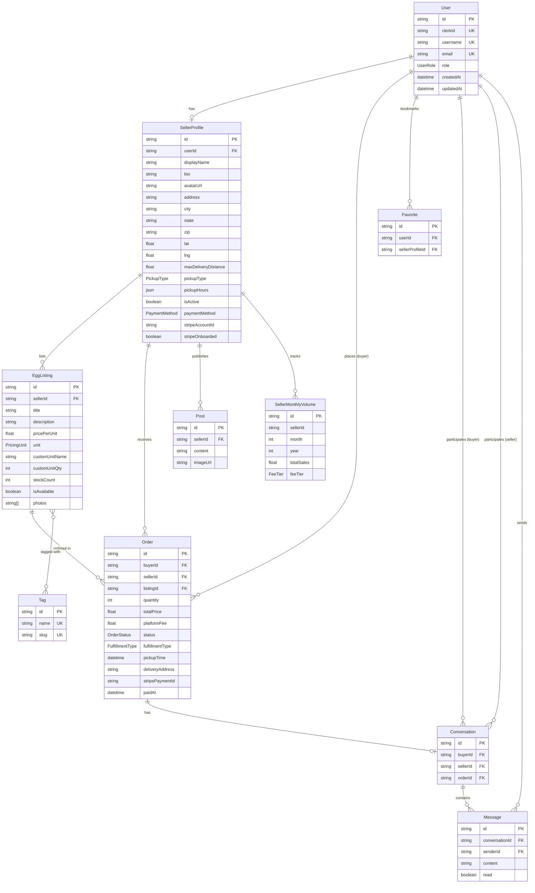
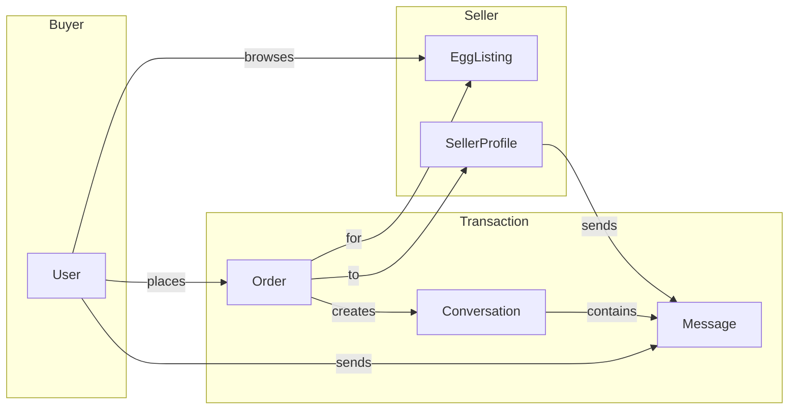
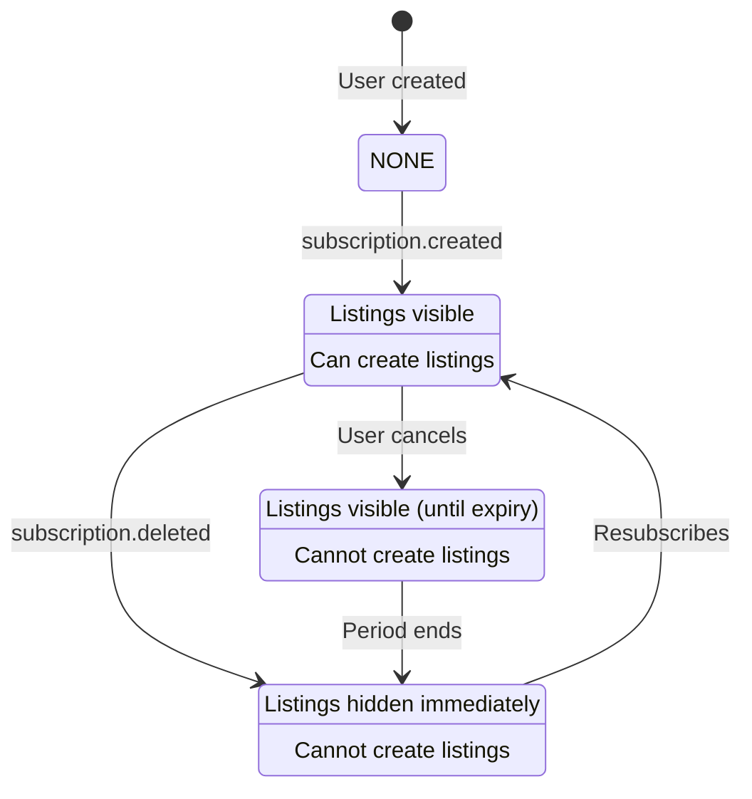
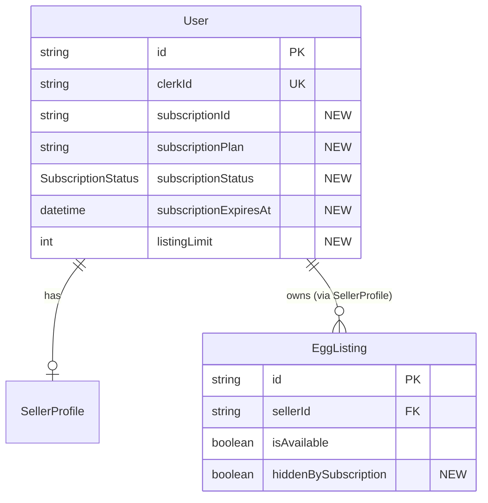

# Eggbook Database Schema

This document describes the current database schema and proposed changes for subscription support.

---

## Current Schema

### User

Synced from Clerk authentication. Core user identity.

| Field | Type | Description |
|-------|------|-------------|
| `id` | String (cuid) | Primary key |
| `clerkId` | String | Clerk user ID (unique) |
| `username` | String | Display username (unique) |
| `email` | String | Email address (unique) |
| `role` | UserRole | BUYER, SELLER, or ADMIN |
| `createdAt` | DateTime | Account creation time |
| `updatedAt` | DateTime | Last update time |

**Relations:**
- `sellerProfile` → SellerProfile (optional, 1:1)
- `orders` → Order[] (as buyer)
- `favorites` → Favorite[]
- `conversations1`, `conversations2` → Conversation[] (as buyer/seller)
- `messages` → Message[]

---

### SellerProfile

Extended profile for sellers with location and payment settings.

| Field | Type | Description |
|-------|------|-------------|
| `id` | String (cuid) | Primary key |
| `userId` | String | FK to User (unique) |
| `displayName` | String | Public display name |
| `bio` | String? | Seller bio/description |
| `avatarUrl` | String? | Profile image URL |
| `address` | String? | Street address |
| `city` | String? | City |
| `state` | String? | State |
| `zip` | String? | ZIP code |
| `lat` | Float? | Latitude for map |
| `lng` | Float? | Longitude for map |
| `maxDeliveryDistance` | Float? | Max delivery radius (miles) |
| `pickupType` | PickupType | TIMESLOT, HOURS, or ARRANGED |
| `pickupHours` | Json? | Available pickup times |
| `isActive` | Boolean | Profile visibility (default: true) |
| `paymentMethod` | PaymentMethod | PLATFORM or OWN_STRIPE |
| `stripeAccountId` | String? | Stripe Connect account ID |
| `stripeOnboarded` | Boolean | Stripe setup complete |
| `createdAt` | DateTime | Profile creation time |
| `updatedAt` | DateTime | Last update time |

**Relations:**
- `user` → User (1:1)
- `listings` → EggListing[]
- `orders` → Order[] (as seller)
- `posts` → Post[]

---

### EggListing

Product listings with flexible pricing units.

| Field | Type | Description |
|-------|------|-------------|
| `id` | String (cuid) | Primary key |
| `sellerId` | String | FK to SellerProfile |
| `title` | String | Listing title |
| `description` | String? | Listing description |
| `pricePerUnit` | Float | Price per unit |
| `unit` | PricingUnit | EGG, HALF_DOZEN, DOZEN, FLAT, CUSTOM |
| `customUnitName` | String? | Name for custom unit |
| `customUnitQty` | Int? | Quantity in custom unit |
| `stockCount` | Int | Available stock (default: 0) |
| `isAvailable` | Boolean | Listing visibility (default: true) |
| `photos` | String[] | Vercel Blob URLs |
| `createdAt` | DateTime | Creation time |
| `updatedAt` | DateTime | Last update time |

**Relations:**
- `seller` → SellerProfile
- `tags` → Tag[] (many-to-many)
- `orders` → Order[]

---

### Tag

Categorization tags for listings.

| Field | Type | Description |
|-------|------|-------------|
| `id` | String (cuid) | Primary key |
| `name` | String | Display name (unique) |
| `slug` | String | URL-safe slug (unique) |

**Relations:**
- `listings` → EggListing[] (many-to-many)

---

### Order

Purchase orders with request-based flow.

| Field | Type | Description |
|-------|------|-------------|
| `id` | String (cuid) | Primary key |
| `buyerId` | String | FK to User |
| `sellerId` | String | FK to SellerProfile |
| `listingId` | String | FK to EggListing |
| `quantity` | Int | Number of units |
| `totalPrice` | Float | Total order price |
| `platformFee` | Float | Eggbook fee (default: 0) |
| `status` | OrderStatus | PENDING, CONFIRMED, PAID, COMPLETED, CANCELLED, DECLINED |
| `fulfillmentType` | FulfillmentType | PICKUP or DELIVERY |
| `pickupTime` | DateTime? | Scheduled pickup time |
| `deliveryAddress` | String? | Delivery address |
| `deliveryLat` | Float? | Delivery latitude |
| `deliveryLng` | Float? | Delivery longitude |
| `stripePaymentId` | String? | Stripe payment intent ID |
| `paidAt` | DateTime? | Payment timestamp |
| `completedAt` | DateTime? | Fulfillment timestamp |
| `cancelledAt` | DateTime? | Cancellation timestamp |
| `cancelReason` | String? | Reason for cancellation |
| `createdAt` | DateTime | Order creation time |
| `updatedAt` | DateTime | Last update time |

**Relations:**
- `buyer` → User
- `seller` → SellerProfile
- `listing` → EggListing
- `conversation` → Conversation (optional, 1:1)

---

### Conversation

Messaging thread between buyer and seller.

| Field | Type | Description |
|-------|------|-------------|
| `id` | String (cuid) | Primary key |
| `buyerId` | String | FK to User |
| `sellerId` | String | FK to User |
| `orderId` | String? | FK to Order (optional, unique) |
| `createdAt` | DateTime | Thread creation time |
| `updatedAt` | DateTime | Last activity time |

**Constraints:**
- Unique on `[buyerId, sellerId]` - one conversation per buyer-seller pair

**Relations:**
- `buyer` → User
- `seller` → User
- `order` → Order (optional)
- `messages` → Message[]

---

### Message

Individual messages within a conversation.

| Field | Type | Description |
|-------|------|-------------|
| `id` | String (cuid) | Primary key |
| `conversationId` | String | FK to Conversation |
| `senderId` | String | FK to User |
| `content` | String | Message text |
| `read` | Boolean | Read status (default: false) |
| `createdAt` | DateTime | Send time |

**Relations:**
- `conversation` → Conversation (cascade delete)
- `sender` → User

---

### Favorite

Buyer bookmarks for sellers.

| Field | Type | Description |
|-------|------|-------------|
| `id` | String (cuid) | Primary key |
| `userId` | String | FK to User |
| `sellerProfileId` | String | FK to SellerProfile |
| `createdAt` | DateTime | Bookmark time |

**Constraints:**
- Unique on `[userId, sellerProfileId]` - one favorite per user-seller pair

**Relations:**
- `user` → User (cascade delete)

---

### Post

Seller feed posts/updates.

| Field | Type | Description |
|-------|------|-------------|
| `id` | String (cuid) | Primary key |
| `sellerId` | String | FK to SellerProfile |
| `content` | String | Post content |
| `imageUrl` | String? | Optional image URL |
| `createdAt` | DateTime | Post time |
| `updatedAt` | DateTime | Last edit time |

**Relations:**
- `seller` → SellerProfile (cascade delete)

---

### SellerMonthlyVolume

Tracks monthly sales for fee tier calculation.

| Field | Type | Description |
|-------|------|-------------|
| `id` | String (cuid) | Primary key |
| `sellerId` | String | Seller identifier |
| `month` | Int | Month (1-12) |
| `year` | Int | Year |
| `totalSales` | Float | Total sales amount (default: 0) |
| `feeTier` | FeeTier | FREE, STARTER, or PRO |

**Constraints:**
- Unique on `[sellerId, month, year]` - one record per seller per month

---

## Enums

### UserRole
- `BUYER` - Can browse and purchase
- `SELLER` - Can list eggs and sell
- `ADMIN` - Full administrative access

### PaymentMethod
- `PLATFORM` - Eggbook handles payments, pays out sellers
- `OWN_STRIPE` - Seller connects their own Stripe account

### PickupType
- `TIMESLOT` - Specific time slots available
- `HOURS` - Display available hours
- `ARRANGED` - Arrange pickup after order

### PricingUnit
- `EGG` - Per individual egg
- `HALF_DOZEN` - 6 eggs
- `DOZEN` - 12 eggs
- `FLAT` - 30 eggs
- `CUSTOM` - Custom unit with `customUnitName` and `customUnitQty`

### OrderStatus
- `PENDING` - Buyer submitted, waiting for seller
- `CONFIRMED` - Seller confirmed the order
- `PAID` - Payment completed
- `COMPLETED` - Order fulfilled
- `CANCELLED` - Cancelled by either party
- `DECLINED` - Seller declined the order

### FulfillmentType
- `PICKUP` - Buyer picks up
- `DELIVERY` - Seller delivers

### FeeTier
- `FREE` - $0-500/month, 0% fee
- `STARTER` - $500-2000/month, 2% fee
- `PRO` - $2000+/month, 3% fee

---

## Proposed Changes for Subscription Support

### New Fields on User

| Field | Type | Description |
|-------|------|-------------|
| `subscriptionId` | String? | Clerk subscription ID |
| `subscriptionPlan` | String? | Plan name (e.g., "seller_plan") |
| `subscriptionStatus` | SubscriptionStatus | Current subscription state |
| `subscriptionExpiresAt` | DateTime? | When subscription ends |
| `listingLimit` | Int? | Max listings allowed (null = unlimited) |

### New Enum: SubscriptionStatus

```prisma
enum SubscriptionStatus {
  NONE      // No subscription
  ACTIVE    // Active and valid
  CANCELED  // User canceled, may still be active until period ends
  EXPIRED   // Subscription ended, listings hidden immediately
}
```

> **Note:** No PAST_DUE status. Listings are hidden immediately on subscription end.

### New Field on EggListing

| Field | Type | Description |
|-------|------|-------------|
| `hiddenBySubscription` | Boolean | True if hidden due to subscription expiry (default: false) |

This field distinguishes listings hidden because the seller's subscription expired from listings the seller intentionally marked as unavailable. When a subscription is reactivated, only listings with `hiddenBySubscription = true` should be restored to `isAvailable = true`.

---

## Entity Relationship Diagrams

### Complete Schema



### Order Flow



### Subscription Flow (Proposed)



> **Note:** No grace period. Listings are hidden immediately when subscription ends.

### Data Model with Proposed Subscription Fields


